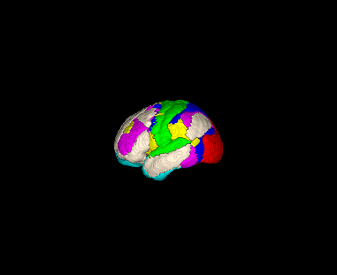
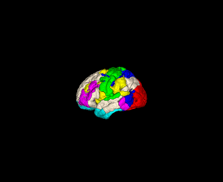

# HCP360 (Glasser) 到 Yeo-7 网络映射

<div align="center">

[English](./README.md) | **简体中文**

</div>

本项目旨在实现 **HCP MMP 1.0 (Glasser 360)** 图谱与 **Yeo 2011 (7 Networks)** 功能分区之间的映射。通过将图谱重采样至同一空间并计算空间重叠率，本项目将 Glasser 图谱中的 360 个皮层区域分配到了 7 个经典的 Yeo 功能子网络中。

<table>
  <tr>
    <td align="center" width="25%"></td>
    <td align="center" width="25%"></td>
    <td align="center" width="25%"></td>
    <td align="center" width="25%"></td>
  </tr>
  <tr>
   <td align="center"><b>HCP360 (Glasser)</b><br>原始图谱</td>
    <td align="center"><b>Yeo-7</b><br>功能网络</td>
    <td align="center"><b>HCP360 Resampled</b><br>对齐至 Yeo 空间</td>
    <td align="center"><b>Mapping Result</b><br>按 Yeo 网络着色的 HCP 区域</td>
  </tr>
</table>

## 📥 快速获取结果

如果您仅需要最终的对照表，而无需运行处理流程，可以直接下载结果文件：

* **映射文件:** [HCP360_to_Yeo7_Mapping.csv](https://github.com/Jingfeng-Tang/HCP360-Glasser-atlas-mapping-Yeo-7-subnetwork/blob/main/HCP360_to_Yeo7_Mapping.csv)

该 CSV 文件包含了 Glasser ROI ID 与 Yeo 网络标签之间的对应关系。

---

## 🚀 使用说明

请按照以下步骤复现映射过程或从头生成文件。

### 0. 环境准备
请确保您的 Python 环境中安装了处理神经影像数据的必要库（例如 `nibabel`, `numpy`, `pandas`）。

### 1. 获取 Yeo 图谱
获取 MNI152 空间下的 Yeo 2011 7网络图谱。
* **运行脚本:** `python fetch_yeo.py`
* **直接下载:** [Yeo2011_7Networks_MNI152.nii.gz](https://github.com/Jingfeng-Tang/HCP360-Glasser-atlas-mapping-Yeo-7-subnetwork/blob/main/Yeo2011_7Networks_MNI152_FreeSurferConformed1mm_LiberalMask.nii.gz)

### 2. 获取 HCP360 图谱
获取 Glasser HCP 360 图谱。
* **原始来源:** [Glasser360 Github](https://github.com/brainspaces/glasser360)
* **本项目备份:** [glasser360MNI.nii.gz](https://github.com/Jingfeng-Tang/HCP360-Glasser-atlas-mapping-Yeo-7-subnetwork/blob/main/glasser360MNI.nii.gz)

### 3. 将 HCP360 重采样至 Yeo 空间
对 HCP360 图谱进行重采样，使其分辨率、仿射矩阵 (Affine) 和维度与 Yeo 模板完全匹配，以确保体素级对齐。
* **运行:**
    ```bash
    python resample_hcp2yeo.py
    ```

### 4. 生成映射关系
计算重采样后的 HCP ROI 与 Yeo 网络的重叠情况，生成最终的 CSV 映射文件。
* **运行:**
    ```bash
    python mapping_hcp2yeo.py
    ```

---

## 📚 参考文献

如果您在研究中使用了这些图谱，请引用原始文献：

1.  **HCP MMP 1.0 (Glasser 360):**
    > Glasser, M. F., Coalson, T. S., Robinson, E. C., Hacker, C. D., Harwell, J., Yacoub, E., ... & Van Essen, D. C. (2016). A multi-modal parcellation of human cerebral cortex. *Nature*, 536(7615), 171-178.

2.  **Yeo 7 Networks:**
    > Yeo, B. T., Krienen, F. M., Sepulcre, J., Sabuncu, M. R., Lashkari, D., Hollinshead, M., ... & Buckner, R. L. (2011). The organization of the human cerebral cortex estimated by intrinsic functional connectivity. *Journal of neurophysiology*, 106(3), 1125-1165.
